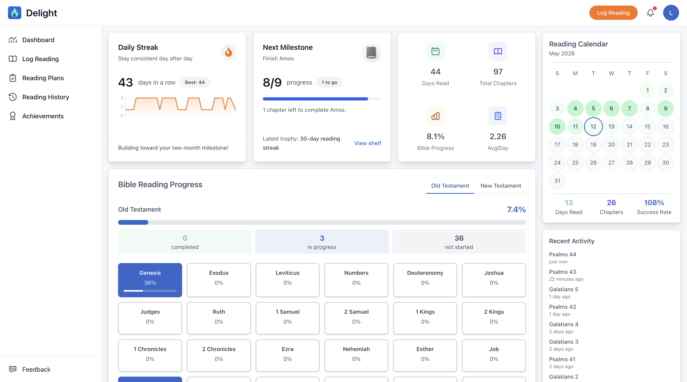

# Delight

Delight is a free Bible reading tracker for building a steady reading rhythm. Log chapters, follow a reading plan, and see your reading history and progress on the web or in the Android companion app.

[Visit mydelight.app](https://mydelight.app) · [Get the Android app](https://mydelight.app/android)



## What you can do

- Log Bible chapters by day, add notes, and browse your reading history.
- Track current and longest streaks, reading activity, and progress through Bible books.
- Follow a daily plan, including canonical, chronological, M’Cheyne, and Catholic canonical plans.
- Earn reading achievements and revisit your year in an annual recap.
- Choose whether to include Deuterocanonical books in your Bible and plan selectors.
- Set your reading time zone and use optional web push reminders.
- Install the web app as a PWA, or use the Android app to log readings and view your dashboard and history.

## How it is built

The web application uses PHP 8.4+ and Laravel 12. Its interface is rendered with Blade, with HTMX for partial page updates; frontend assets use Tailwind CSS, Flowbite, Alpine.js, and Vite. Domain workflows live in `app/Services`, and the HTTP entry points are in `routes/web.php` and `routes/api.php`.

The Android-first companion app is a standalone Expo and React Native package in `mobile/`. It uses the Laravel versioned API; it is not part of the root npm package.

## Run the web app locally

### Requirements

- PHP 8.4 or newer with SQLite support (`pdo_sqlite`)
- Composer
- Node.js and npm

### Setup

```bash
git clone https://github.com/Orlando-Villanueva/delight.git
cd delight
composer install
npm ci
cp .env.example .env
touch database/database.sqlite
php artisan key:generate
php artisan migrate --seed
```

The example environment uses SQLite and Mailpit for local email. The seed command adds reading plans and sample development data. Keep real credentials in `.env`; do not commit that file.

Start these in separate terminals from the repository root:

```bash
npm run dev
```

```bash
php artisan serve
```

Then open [http://localhost:8000](http://localhost:8000). To compile frontend assets without Vite's development server, run `npm run build`.

### Optional integrations

- **Google sign-in:** add a Google OAuth client to `GOOGLE_CLIENT_ID` and `GOOGLE_CLIENT_SECRET` in `.env`.
- **Web push reminders:** configure the VAPID settings shown in `.env.example`.
- **Local email testing:** run Mailpit with SMTP on port `1025` and its web inbox on port `8025`.

## Run the mobile app

The mobile app has its own dependencies and environment file. For a limited Expo Go UI workflow:

```bash
cd mobile
cp .env.example .env.local
npm ci
npm start
```

Native Google sign-in and the full device workflow require a development build. See [`mobile/README.md`](mobile/README.md) for device setup, environment details, and mobile checks.

## Tests and checks

From the repository root:

```bash
php artisan test
npm run build
```

The mobile package has its own lint, typecheck, configuration, and Jest commands. Run them from `mobile/`; see its [README](mobile/README.md).

## Project structure

| Path | Contents |
| --- | --- |
| `app/` | Laravel controllers, models, services, and actions |
| `resources/` | Blade views, JavaScript, and CSS |
| `routes/` | Web and versioned API routes |
| `database/data/reading-plans/` | Reading-plan schedules |
| `mobile/` | Standalone Expo and React Native app |
| `tests/` | Laravel feature and unit tests |
| `docs/` | Feature and operations documentation |

## More documentation

- [Contributing](CONTRIBUTING.md)
- [Mobile app setup](mobile/README.md)
- [Reading plans](docs/reading-plans/README.md)
- [Annual recap](docs/annual-recap/README.md)
- [Manual testing checklist](manual-testing-checklist.md)

## Project identity

Delight is an independent product created and maintained by Orlando Villanueva. Contributions are welcome, and the source code is available under GPLv3.

The Delight name, logo, visual identity, and official service at [mydelight.app](https://mydelight.app) remain associated with the original project. Forks and modified versions should use distinct branding and must not imply that they are official Delight releases or services.

## License

This project is licensed under the GNU General Public License v3.0. See [LICENSE](LICENSE) for details.
